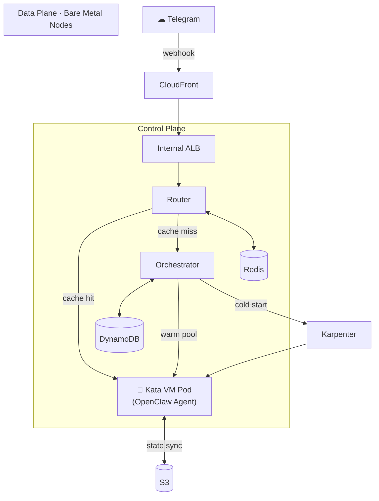

## Multi-tenancy OpenClaw on EKS

### Background

[OpenClaw](https://github.com/openclaw/openclaw) is an open-source AI agent framework designed for **single-user** operation — one instance serves one user. This works well for individual use, but presents a challenge when you want to offer OpenClaw as a service to many users simultaneously.

### What This Project Does

This sample project provides the **orchestration layer** that turns single-user OpenClaw instances into a multi-tenant service on Amazon EKS. Rather than modifying OpenClaw itself, it manages the full lifecycle of many isolated OpenClaw instances — provisioning, routing, state persistence, and teardown — so each tenant gets a dedicated agent with VM-level isolation via [Kata Containers](https://katacontainers.io/).

> **Note:** This is a reference implementation for learning and experimentation. It uses Telegram as the sole messaging channel for demonstration purposes. Production deployments would need to adapt the webhook routing and channel integration to your specific requirements.

### Architecture

### How It Works

1. **Webhook arrives** — Telegram sends a message to CloudFront → Internal ALB → Router
2. **Routing** — Router checks Redis for the tenant's pod IP. On cache miss, it calls the Orchestrator to wake the tenant
3. **Pod lifecycle** — Orchestrator creates a Kata VM pod (or claims one from the warm pool), restores state from S3, and starts the OpenClaw agent
4. **Isolation** — Each tenant runs in a separate microVM (Kata Containers), with VPC CNI NetworkPolicy enforcing network boundaries and S3 ABAC restricting data access
5. **Idle management** — After a configurable timeout, the Informer-based reconciler tears down idle pods, syncing state to S3 before termination

### Key Features

- **VM-level tenant isolation** — Kata Containers microVM per tenant on bare metal nodes
- **Network isolation** — VPC CNI NetworkPolicy (eBPF) enforces cross-tenant boundaries
- **Data isolation** — EKS Pod Identity ABAC session tags restrict S3 access per tenant
- **Event-driven reconciler** — K8s Informer detects pod failures in ~1s
- **Warm pool** — Pre-provisioned pods with PriorityClass preemption for faster cold start
- **Graceful persistence** — PreStop hook guarantees final S3 state sync
- **CLI tooling** — `otm` CLI for tenant CRUD, config management, log streaming

### Components

| Component | Role |
|-----------|------|
| **Router** | Webhook ingress, async pod wake + message forwarding |
| **Orchestrator** | Tenant lifecycle, DynamoDB registry, Informer reconciler, warm pool |
| **Redis** | Pod IP cache, distributed lock, shared config |
| **DynamoDB** | Tenant registry with GSI for status queries |
| **S3** | Per-tenant state persistence |
| **Karpenter** | Bare metal node autoscaling for Kata workloads |

### Documentation

| Document | Description |
|----------|-------------|
| [Architecture](docs/architecture.md) | System design, Mermaid diagrams, decision rationale |
| [Setup Guide](docs/setup-guide.md) | End-to-end deployment with real-world lessons learned |
| [Operations](docs/operations.md) | Day-to-day operations, `otm` CLI reference, troubleshooting |
| [Configuration](docs/configuration.md) | Environment variables and config options |
| [Cold Start Analysis](docs/cold-start-analysis.md) | Kata vs runc, cold vs warm benchmark |
| [Kata Containers](docs/kata-containers.md) | Resource overhead and pod density analysis |
| [Network Policy](docs/network-policy-validation-report.md) | VPC CNI + Kata compatibility validation |

### Getting Started

See the [Setup Guide](docs/setup-guide.md) for step-by-step deployment instructions.

## Security

See [CONTRIBUTING](CONTRIBUTING.md#security-issue-notifications) for more information.

## License

This project is licensed under the Apache-2.0 License.
