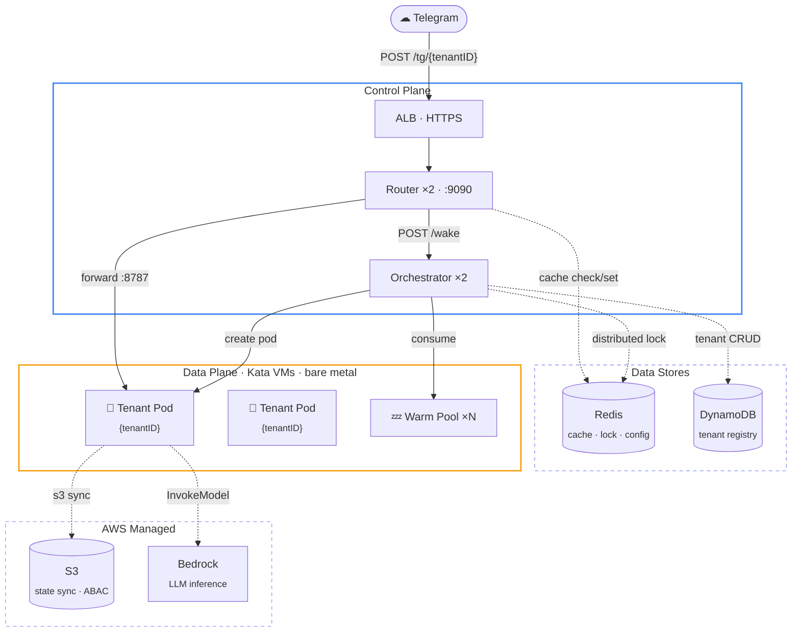
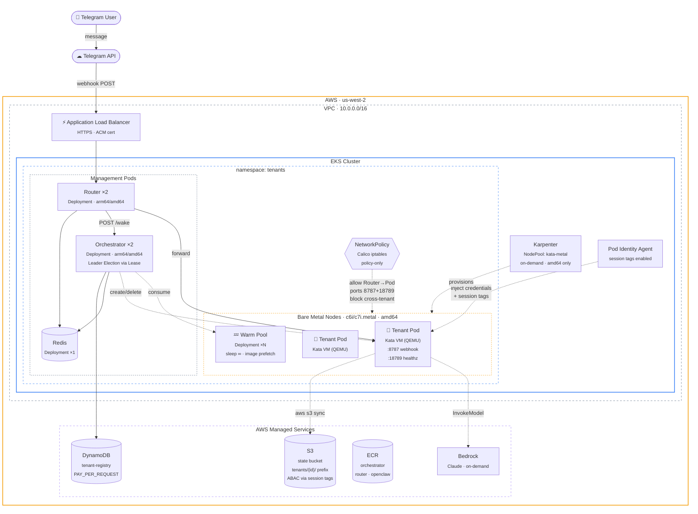
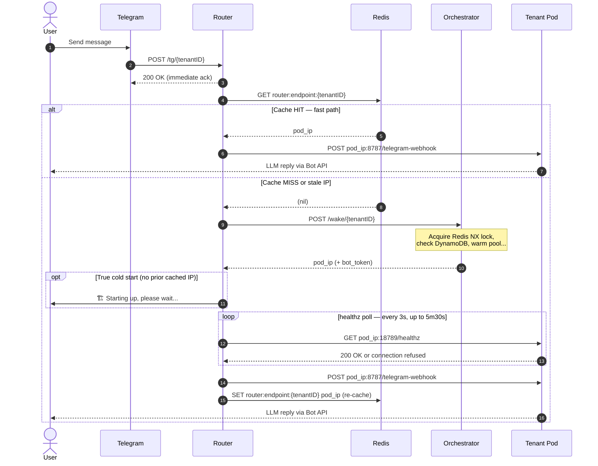
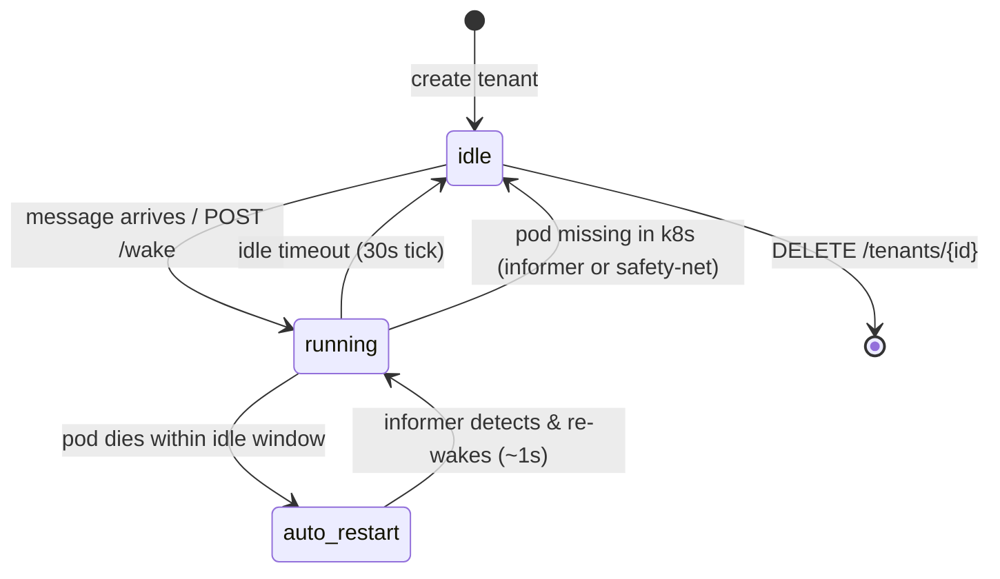
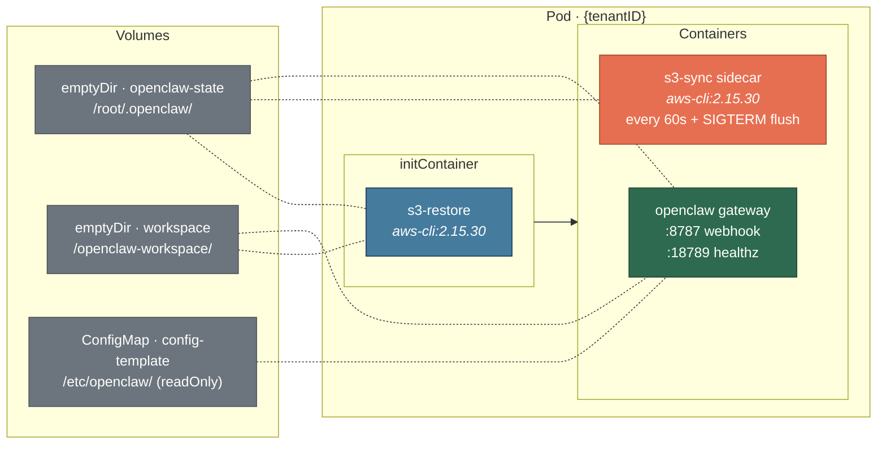
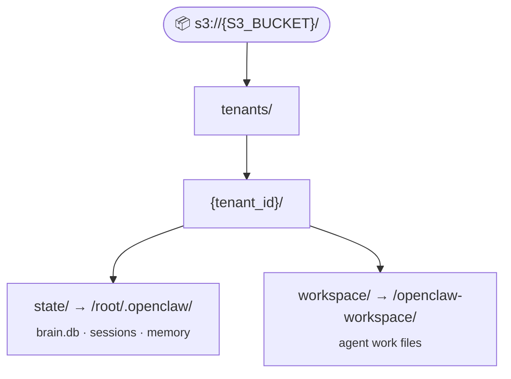
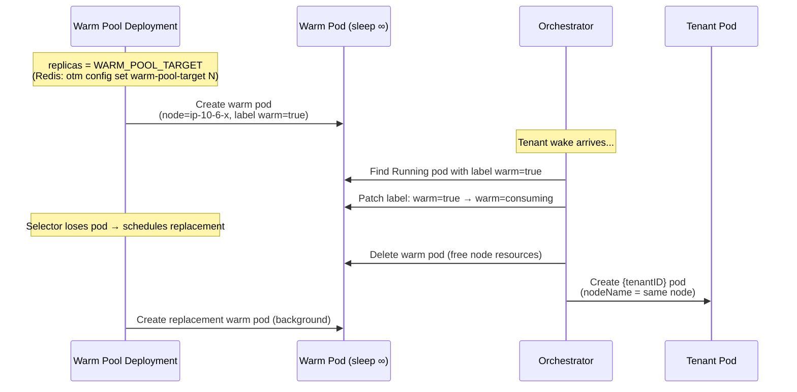
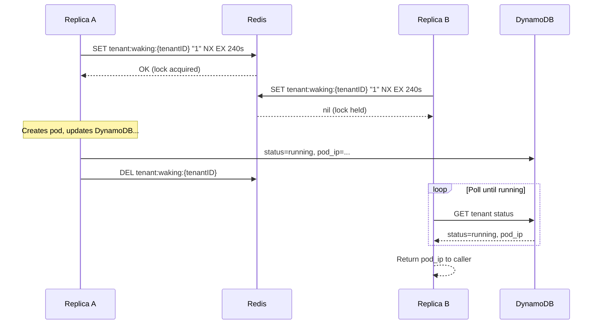

# Architecture

Deep dive into the openclaw-tenancy system design, component interactions, and infrastructure decisions.

---

## Architecture Overview




---

## AWS Infrastructure



### Key Infrastructure Decisions

| Decision | Choice | Reason |
|----------|--------|--------|
| Instance type | `c6i/c7i.metal` (amd64) | Kata needs `/dev/kvm`; Graviton metal lacks KVM |
| Node provisioning | Karpenter | Auto-scale bare metal on demand, avoid idle cost |
| Container runtime | `kata-qemu` | VM-level tenant isolation (guest kernel per pod) |
| NetworkPolicy engine | Calico iptables policy-only | VPC CNI eBPF conflicts with Kata TC redirect |
| State storage | S3 + `aws s3 sync` | S3 CSI (mountpoint-s3) is write-once FUSE, can't overwrite |
| Data isolation | S3 ABAC via Pod Identity session tags | Zero extra IAM Roles; `${aws:PrincipalTag/kubernetes-pod-name}` restricts prefix |
| Tenant registry | DynamoDB PAY_PER_REQUEST | Multi-replica concurrent R/W, cross-pod persistence |
| Image build | `docker buildx` multi-arch | Cluster has both amd64 + arm64 nodes |
| Image registry | ECR (private) | Same region, no cross-region pull latency |


---

## Message Flow



### Timing

| Scenario | Total latency |
|---|---|
| Pod already running (cache hit) | ~2–5 s (LLM response time) |
| Warm pool hit (node pre-provisioned) | ~40–60 s (s3-restore ~3 s + OpenClaw init ~37 s) |
| Cold start (Karpenter provisions node) | ~3–5 min (metal node provision + above) |

> **Starting notification** is sent only on true cold starts — when no cached IP existed before the wake call. Cache-miss retries (stale IP → re-wake) do **not** re-notify the user.

> **Cache preservation**: after the healthz poll succeeds, the Router re-sets `router:endpoint:{tenantID}` to keep the cache warm for subsequent messages.

---

## Pod Lifecycle



### State Transitions

| Component | Trigger | Transition |
|---|---|---|
| **API handler** `/wake` | `POST /wake/{id}` | idle → running |
| **Lifecycle controller** | 30 s tick (leader only) | running → idle if `now - last_active_at > idle_timeout_s` |
| **Reconciler** | K8s Informer (event-driven) + 5 min safety-net | running → idle if pod not found in k8s |
| **Reconciler** | pod dies within idle window (~1s detection) | auto-restart → running |
| **API handler** `/delete` | `DELETE /tenants/{id}` | any → deleted |

---

## Pod Spec

Each tenant pod (`{tenantID}`) has three containers:



### Container Details

| Container | Image | Purpose |
|---|---|---|
| **s3-restore** (init) | `public.ecr.aws/aws-cli/aws-cli:2.15.30` | Restore state & workspace from S3 before OpenClaw starts. Excludes `openclaw.json`, `*.lock` |
| **openclaw** (main) | `{ECR}/openclaw@sha256:{digest}` (pinned) | OpenClaw Gateway — Telegram webhook mode. Config rendered from ConfigMap template via `envsubst` on start |
| **s3-sync** (sidecar) | `public.ecr.aws/aws-cli/aws-cli:2.15.30` | `aws s3 sync` every 60 s + final sync on SIGTERM. Excludes `openclaw.json*` |

### Volumes

| Name | Type | Mount | Notes |
|---|---|---|---|
| `openclaw-state` | emptyDir | `/root/.openclaw/` | OpenClaw state (memory, sessions) |
| `workspace` | emptyDir | `/openclaw-workspace/` | Agent workspace files |
| `config-template` | ConfigMap | `/etc/openclaw/` (readOnly) | `openclaw.json.tpl` — rendered on start |

> No PVCs. S3 CSI (mountpoint-s3) was evaluated and rejected — write-once FUSE, cannot overwrite or delete existing files.

---

## State Persistence

### S3 Layout



### S3 ABAC (Attribute-Based Access Control)

Tenant pods use **EKS Pod Identity** with session tags to scope S3 access per tenant:

| Mechanism | Detail |
|---|---|
| **Pod Identity Association** | Service account `openclaw-tenant` → IAM role `openclaw-tenant-pod-identity` |
| **Session Tag** | `kubernetes-pod-name = {tenantID}` (injected by Pod Identity webhook) |
| **IAM Condition** | `ListBucket` scoped by `s3:prefix`; `Get/Put/Delete` scoped by Resource ARN with `${aws:PrincipalTag/kubernetes-pod-name}` |
| **Effect** | Each pod can only read/write its own `tenants/{tenantID}/` prefix — enforced at IAM level |

### Consistency Properties

- **Last-write-wins**: `aws s3 sync` with no `--delete`. S3 accumulates extra files; OpenClaw tolerates extras.
- **Loss window**: If pod is killed without SIGTERM (OOM, node failure), up to 60 s of state lost. Acceptable for agent memory (append-only).
- **`openclaw.json` excluded**: Always regenerated from template via `envsubst`. Restored config would have wrong auth tokens.
- **Lock files excluded**: `.lock` files from previous lifetime cause "session file locked" errors.

---

## Warm Pool

Pre-provisioned nodes to eliminate Karpenter provisioning latency (~3–4 min → ~40 s).



Warm pods run `sleep infinity` — they pre-pull the openclaw image and hold the node but do **not** start OpenClaw. OpenClaw still needs ~37 s to initialize after the tenant pod starts.

**Configuration**: warm pool target is stored in Redis and adjustable at runtime:

```bash
otm config set warm-pool-target <N>
```

---

## High Availability

Orchestrator runs **2 replicas**. Coordination mechanisms:

### Redis Wake Lock

Prevents duplicate pod creation for the same tenant.



### Kubernetes Lease Leader Election

Only one replica runs the idle timeout loop.

| Parameter | Value |
|---|---|
| Lease name | `orchestrator-leader` (tenants namespace) |
| Duration | 15 s |
| Renew | 10 s |
| Retry | 2 s |
| Leader runs | `checkIdleTenants()` every 30 s |

### Reconciler (All Replicas)

Event-driven via **K8s SharedInformer** watching `app=openclaw` pods. Runs on every replica (idempotent).

**Event-driven path** (~1s response):
- Pod DELETE → check DynamoDB, auto-restart if within idle window
- Pod UPDATE (phase → Failed/Succeeded, or IP change) → reconcile single tenant

**Safety-net full reconcile** (every 5 min, configurable via `RECONCILER_INTERVAL`):
- Stale running tenant: pod missing in k8s → reset DynamoDB to idle
- Orphan pod: `{tenantID}` pod with no running tenant in DynamoDB → delete (90s grace)
- IP drift: pod IP changed → update Redis cache + DynamoDB

---

## Infrastructure

### EKS Cluster

| Item | Value |
|---|---|
| Cluster | `<EKS_CLUSTER>`, `us-west-2`, account `<AWS_ACCOUNT_ID>` |
| Namespace | `tenants` |
| Ingress | `<DOMAIN>` → ALB → Router:9090 |
| Runtime | Kata Containers (`kata-qemu`) — VM-level isolation for all tenant pods |

### Kata Containers / Bare Metal

Kata requires hardware virtualization (`/dev/kvm`). Only `.metal` EC2 instances expose this.

Karpenter NodePool `kata-metal` provisions `c/m/r` gen-6+ metal nodes with:
- **Devmapper** thin-pool snapshotter (required by kata-qemu)
- **Taint** `kata-runtime=true:NoSchedule` — only kata-tolerating pods schedule here

### NetworkPolicy

Network isolation uses **VPC CNI NetworkPolicy** (`NETWORK_POLICY_ENFORCING_MODE=standard`). Validated compatible with both runc and Kata Containers on EKS 1.35 / VPC CNI v1.21.1 (8/8 tests passed for Kata pods). No Calico needed.

| Policy | Effect |
|---|---|
| **tenant-pod-isolation** | Ingress: only `app=router` on `:8787` and `:18789`. Egress: DNS, Pod Identity Agent, IMDS, all external (except VPC/Service CIDRs) |
| **orchestrator-policy** | Egress to Redis, K8s API server (`172.20.0.1:443`), Pod Identity Agent, external HTTPS |
| **router-policy** | Ingress from VPC (ALB). Egress to orchestrator, Redis, tenant pods, external HTTPS |
| **redis-policy** | Ingress from orchestrator + router only. No egress |
| **warm-pool-policy** | No ingress, no egress (`sleep infinity`) |

> **Key egress rules**: Must explicitly allow Pod Identity Agent (`169.254.170.23:80,443`) and IMDS (`169.254.169.254:80`) — without these, AWS credential retrieval fails inside tenant pods.
| **Allow Pod → Telegram** | Egress to `api.telegram.org` (Bot API replies) |
| **Deny Pod → Pod** | No lateral movement between tenant pods |

### IAM

| Role | Service Account | Permissions |
|---|---|---|
| `openclaw-tenant-pod-identity` | `openclaw-tenant` | Bedrock: `InvokeModel`, `InvokeModelWithResponseStream`; S3: read/write on `<S3_BUCKET>` (scoped by ABAC session tags) |

---

## Security

### BotToken Handling

| Aspect | Detail |
|---|---|
| Stored in | DynamoDB `bot_token` field (encrypted at rest) |
| Redacted from | All public API responses |
| Internal access | `GET /tenants/{id}/bot_token` — used by Router for Telegram notifications |
| Pod access | `TELEGRAM_BOT_TOKEN` env var (used by OpenClaw) |

### Tenant Isolation

| Layer | Mechanism |
|---|---|
| **Compute** | Each tenant in dedicated Kata VM (QEMU) — hardware-enforced memory/CPU isolation |
| **Storage** | Dedicated S3 prefix per tenant (`tenants/{tenantID}/`), enforced by ABAC session tags |
| **Network** | Calico NetworkPolicy — deny lateral movement, allow only required egress |
| **IAM** | Pod Identity session tags + IAM condition on `${aws:PrincipalTag/kubernetes-pod-name}` |

> **Shared IAM role caveat**: All tenant pods share one IAM role (single service account). CloudTrail cannot attribute Bedrock usage per tenant — application-level tracking is needed for billing.
